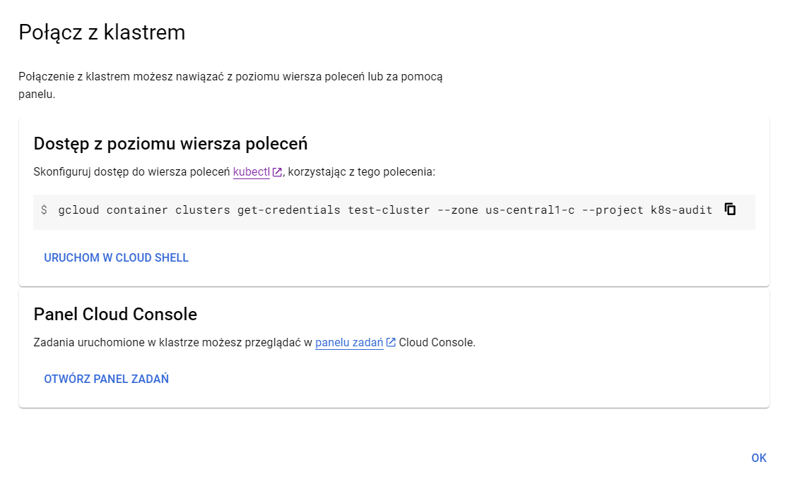

# Aplikacja

## Pre-deployment - Google Cloud CLI
Rzeczy ktore nalezy skonfigurowac przed deploymentem:
- zainstalowanie google cloud CLI (wybierz metode z installerem https://cloud.google.com/sdk/docs/downloads-interactive)
- zainstalowanie `gke-cloud-auth-plugin` https://cloud.google.com/kubernetes-engine/docs/how-to/cluster-access-for-kubectl#install_plugin
- zainstalowanie kubectl - https://cloud.google.com/kubernetes-engine/docs/how-to/cluster-access-for-kubectl#install_kubectl

Po instalacji komponentow, aby polaczyc sie z klastrem wpisz:
```
gcloud auth login
```
Zaloguj sie przy uzyciu przegladarki, jesli masz odpowiednie uprawnienia do projektu ponizsza komenda powinna zadzialac:
```
gcloud container clusters get-credentials test-cluster --zone us-central1-c --project k8s-audit
```
Ta komenda generuje konfiguracje dla narzedzia `kubectl` sluzacego do administrowania klastrami.
<br>Wygenerowana konfiguracja pozwala na laczenie sie z okreslonym w komendzie klastrem.


## Pre-deployment - bez Google Cloud CLI
Uzyj Cloud Shell'a bezposrednio na stronie GCP

</img>

## Weryfikacja CLI
Aby zweryfikowac polaczenie wpisz:
```
kubectl get nodes
```
Komenda powinna nie zwrocic error'a.

## Pre-deployment: Repo Github
Aby uzyskac pliki konfiguracyjne, sklonuj to repozytorium Git.

## Pre-deployment: Ingress Controller
Przed instalacja aplikacji sprawdz, czy jest zainstalowany `Nginx Ingress Controller`:
```
kubectl get ns | grep ingress-nginx
```
Jesli komenda nie zwraca nic, to znaczy ze musisz go zainstalowac (z doca `deploy/ingress/doc.md`).


## Deployment
Pliki do deploymentu apki sa w folderze `deploy/`. Wejdz do tego folderu.
<br>Aby poprawnie zainstalowac aplikacje, nalezy w przedstawionej kolejnosci wykonac komendy:

### ConfigMap + Secret - Postgres
```
kubectl apply -f app/configmap/postgres-configmap.yaml
```

```
kubectl apply -f app/secret/secret.yaml
```

### PersistentVolume - Postgres
```
kubectl apply -f app/postgres/postgres-pv.yaml
```

### Deployment + Service - Postgres
```
kubectl apply -f app/postgres/postgres-depl.yaml
```

### Deployment + Service - Aplikacja
```
kubectl apply -f app/fruitapp/app-deployment.yaml
```

### Ingress Object - Aplikacja
```
kubectl apply -f ingress/ingress-resource-1.yaml
```